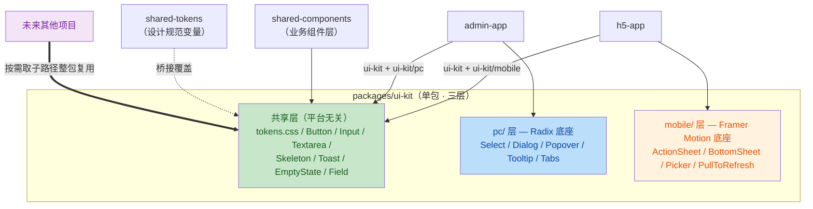

# LiteShop UI 组件库（ui-kit）设计方案

> 定稿日期：2026-09-07
> 状态：**已决策**——H6 正式选 B（不引入 antd-mobile/antd），以独立 ui-kit 包作为通用 UI 层
> 关联文档：《代码分析报告与修复建议.md》（H6/M3/M7）、《CRM项目借鉴分析.md》（3.1/3.2/5.4）

---

## 一、目标与原则

**建库动机**（按重要性排序）：

1. **跨项目复用**：封装 Button/Input/Select/Form 等通用件 + token 主题机制，未来其他项目整包拎走即用
2. **固定组件风格**：视觉与 API 的一致性由 token + 组件规范保证，形成个人/团队统一的组件语言
3. **本项目收益**：填补 M3（toast 化）、plan-07 遗留（Skeleton）、表单手写 useState 的现状缺口

**四条铁律**：

| # | 铁律 | 理由 |
|---|---|---|
| 1 | ui-kit **零业务依赖**（禁止 import `@liteshop/*`） | 可搬走是建库前提，混入业务类型即废 |
| 2 | **不造表单引擎**：Form = react-hook-form + zod 的样式化薄层 | 引擎层自研是组件库头号死因；宪法本就规定 RHF + zod |
| 3 | **交互原子件基于 headless 底座**（Radix UI），只自有样式层与 API | a11y/键盘/弹层定位由底座保证（shadcn 模式）；代码仍在本仓库 |
| 4 | **Rule of Three 生长**：无真实调用方不进库 | 防止 lxComponent 式 `index 2 copy 2.tsx` 投机膨胀 |
| 5 | **分平台不分库**：单包内部分「共享层 / pc / mobile」三层，子路径导出 | 两端交互范式不同必须分层（Radix desktop-first vs 触摸手势）；单人维护拆两库则版本/token 双漂移，与"固定风格"目标冲突 |

**平台划分依据**（2026-09-07 已决策：单包分层）：

- **不能一套通吃**：Select 在 PC 是下拉+键盘导航、在移动是 ActionSheet/滚轮；Modal 在 PC 是居中 Dialog+焦点陷阱、在移动是 BottomSheet+下滑关闭；触摸目标 44px vs 鼠标 24px；hover/右键/拖拽 vs PullToRefresh/手势/安全区——这类差异无法用 CSS 变量抹平（业界先例：antd / antd-mobile 分立，TDesign 分 PC/移动包但共享 token）
- **不拆两个独立包**：平台无关组件占大头（Button/Input/Skeleton/EmptyState/Toast 队列/Field 表单接线——RHF 薄层完全不分平台，逻辑统一仅叶子组件换）；单包保证同版本同 token；子路径导出 + ESM tree-shaking 让 PC-only 项目不背移动端代码

## 二、总体架构



**依赖规则**（强制，写入各包 package.json）：

```
ui-kit            deps: radix-ui, framer-motion, clsx    peerDeps: react      ❌ @liteshop/*
shared-components deps: @liteshop/ui-kit                  （业务组件可消费共享层）
apps              h5: ui-kit + ui-kit/mobile；admin: ui-kit + ui-kit/pc
site-app          不接入（维持 Tailwind + shadcn，避免两套体系并存）
```

## 三、技术选型

### 3.1 PC 层底座：Radix UI

| 对比项 | Radix UI（选定） | Base UI |
|---|---|---|
| 组件覆盖 | 40+ 组件，Select/Dialog/Popover/Tabs 齐全 | ~25 个，覆盖面较窄 |
| 生态 | shadcn/ui 底座，社区最大 | 2025 年 1.0，生态尚小 |
| 与本项目契合 | 宪法为 site-app 已规划 shadcn/ui，同一底座心智 | — |
| 平台定位 | **desktop-first**（hover/键盘/焦点管理强项） | 同为 PC 向 |

- 引入方式：统一包 `radix-ui`（`import { Dialog, Select } from 'radix-ui'`），tree-shakeable 按需几 KB
- **风格 100% 自有**：底座只管交互与 a11y，视觉全部走 `--ui-*` token，这正是"固定组件风格"的实现路径

### 3.2 移动层底座：Framer Motion 手写

移动端没有"Radix 级"的成熟 headless 底座，且移动组件的交互复杂度特征不同（弹层/手势为主，键盘导航与焦点管理诉求弱）：

- **Framer Motion 11.x**：宪法技术栈本就包含（UI 动画），BottomSheet = fixed 定位 + 滑动动画 + 背板，ActionSheet/Picker 同构
- **PullToRefresh**：纯触摸事件手写（plan-07 规划件，正好收编入 mobile 层）
- 移动层组件数量少（h5 以内容展示为主），手写成本可控；a11y 侧保留 `role`/`aria-*` 基本要求

### 3.3 Form：react-hook-form 薄层（非引擎，归属共享层）

```tsx
// 封装目标形态：视觉统一 + RHF 接线，逻辑零自研
<Field label="收货人" error={errors.name?.message} required>
  <Input {...register('name', { required: '请填写收货人' })} />
</Field>

// Select 接线走 Controller（受控组件标准姿势）
<Field label="省份" error={errors.province?.message}>
  <Controller
    name="province"
    control={form.control}
    render={({ field }) => <Select options={PROVINCES} value={field.value} onChange={field.onChange} />}
  />
</Field>
```

- zod schema 与后端 Pydantic 契约对齐，一份定义双端复用
- `Form` 组件只做 `FormProvider` + layout + 提交防抖（复用 useDebounceAction 的 controller 思路）

## 四、Token 主题机制

```css
/* packages/ui-kit/src/tokens.css —— 自带默认值，可独立运行 */
:root {
  --ui-color-primary: #ff6b6b;
  --ui-color-text: #1f2329;
  --ui-color-bg: #ffffff;
  --ui-radius-md: 8px;
  --ui-shadow-md: 0 4px 12px rgba(0, 0, 0, 0.08);
  --ui-z-modal: 1000;      /* z-index 层级 token 化（AGENTS 4.4.3） */
  --ui-z-toast: 1010;
}

[data-theme='dark'] {       /* 换主题 = 换一组变量赋值，组件零改动 */
  --ui-color-primary: #ff8787;
  --ui-color-bg: #17171a;
}
```

**与本项目的桥接**（设计规范仍是唯一事实源）：

```css
/* 各 app 的全局样式：把设计规范的值映射到 --ui-* */
:root {
  --ui-color-primary: var(--color-primary);
  --ui-radius-md: var(--radius-md);
}
```

- ui-kit 在其他项目使用时：直接用默认值，或宿主覆盖任意子集
- **M7（tokens.css 混乱）修复是本节的地基**：字号重复命名、gallery 变量混入 `:root`、z-index 缺失不先修，主题机制即建在流沙上

## 五、组件规划

| 组件 | 归属层 | 底座 | 优先级 | 首个真实调用方（触发条件） |
|---|---|---|---|---|
| Button | 共享 | 无（纯样式） | P0 | 迁移现有 shared-components/Button.tsx |
| Input / Textarea | 共享 | 无 | P0 | admin 编辑器、h5 地址表单 |
| Toast | 共享（队列+API 共享，渲染位置分平台：PC 右上/移动居中） | 自实现队列 | P0 | M3 错误处理 toast 化（两应用立即受益） |
| Skeleton | 共享 | 无 | P0 | plan-07 遗留补课（H5 加载态） |
| Field（表单薄层） | 共享 | react-hook-form | P1 | 引入 RHF 时（需先完成依赖引入确认） |
| Select | pc | Radix Select | P1 | admin 列表筛选 |
| Modal / Dialog | pc | Radix Dialog | P1 | admin 订单操作弹层 |
| ActionSheet | mobile | Framer Motion | P1 | h5 筛选/规格选择 |
| BottomSheet | mobile | Framer Motion | P1 | h5 详情半屏抽屉 |
| PullToRefresh | mobile | 手写触摸 | P1 | plan-07 规划件收编 |
| Checkbox / Switch | pc（Radix）/ mobile（FM）各一份 | Radix / FM | P2 | 按需（Rule of Three） |
| Popover / Tooltip | pc | Radix | P2 | 按需 |
| Tabs | pc | Radix | P2 | 按需 |
| Picker（滚轮/级联） | mobile | Framer Motion | P2 | h5 地址级联选择 |

## 六、包结构与构建

```
packages/ui-kit/
├── package.json          # name: @liteshop/ui-kit；exports 三层子路径
├── src/
│   ├── tokens.css        # --ui-* 默认主题 + [data-theme] 覆盖（两端共享一份）
│   ├── index.ts          # 共享层出口 + export const VERSION
│   ├── button/           # ── 共享层（平台无关）──
│   │   ├── Button.tsx    # Props interface + TSDoc（宪法 E4.3）
│   │   ├── Button.stories.tsx   # 文档共址（CRM 借鉴 3.2）
│   │   └── button.css
│   ├── input/  skeleton/  toast/  empty-state/  field/
│   ├── pc/               # ── PC 层（Radix 底座）──
│   │   └── select/ dialog/ popover/ tooltip/ tabs/
│   └── mobile/           # ── 移动层（Framer Motion 底座）──
│       └── action-sheet/ bottom-sheet/ picker/ pull-to-refresh/
└── test/                 # 每组件至少渲染 + 交互冒烟测试
```

**子路径导出**（消费方按平台取用，ESM tree-shaking 保证互不打包）：

```json
{
  "exports": {
    ".": "./src/index.ts",
    "./pc": "./src/pc/index.ts",
    "./mobile": "./src/mobile/index.ts",
    "./tokens.css": "./src/tokens.css"
  }
}
```

- **构建**：vite lib mode（仓库现有工具链），产物 ESM + d.ts + css
- **peerDependencies 声明 react**，杜绝 lxComponent `export * from 'antd'` 式宿主版本锁死
- **零副作用入口**：不做 locale/全局 css 注入，副作用留给 app 层

## 七、规范约束

1. **SemVer + CHANGELOG 真实生效**：跨项目复用后 breaking change 由自己的其他项目承担，§4.4 规约从"流程要求"变为"切身利益"
2. **a11y 与受控/非受控从第一天做对**（后期 retrofit 极难）：键盘可达、focus 管理、`current` 未传走内部 state 的双模式协议（CRM 借鉴 3.3）
3. **组件 API 一旦有第二个宿主，改动需考虑兼容**：宁可保守
4. **跨平台 API 一致性**（防两端口味分裂）：同名概念同 props 签名——`options` / `value` / `onChange` / `visible` 在 `pc/Select` 和 `mobile/ActionSheet` 上保持一致，开发者换端只换 import 路径不换思维模型
5. **重复检测**：每次新组件进库跑 project-radar 第 6 步，防止与 shared-components 现有件重复

## 八、实施路线图

| 阶段 | 内容 | 前置/验证 |
|---|---|---|
| **Phase 0** | M7 tokens 修复（去重字号/隔离 gallery/补 z-index）+ **AGENTS.md 技术栈条款修订**（删 antd-mobile/antd 行，写入 ui-kit 定位与依赖铁律） | AGENTS.md 修订属宪法变更，执行前单独确认 |
| **Phase 1** | ui-kit 包骨架：package.json（三层 exports）+ vite lib 构建 + tokens.css + Button 迁入（含 stories + 测试）。**三层目录结构（含空 pc/ mobile/ 出口）第一天即建立** | `pnpm build && pnpm test` |
| **Phase 2** | 共享层种子组件 Toast / Skeleton / Input + h5/admin 接入（Toast 与 M3 错误处理同批落地） | 各 app `tsc --noEmit && pnpm test && pnpm build` |
| **Phase 3** | RHF + zod 引入（依赖决策）→ Field 薄层（共享层）；pc 层 Select/Dialog 随 admin 真实需求、mobile 层 PullToRefresh/ActionSheet/BottomSheet 随 h5 需求分别进库 | Rule of Three 把关 |

Phase 0/1 改动小、无业务风险，可与既有修复批次 3（工程卫生）合并执行。

## 九、与现有文档的关系

| 事项 | 处理 |
|---|---|
| H6（UI 库缺失） | **已决策：选 B**（维持无 antd），但升级为"自研 ui-kit"路线，非裸手写；两份既有文档已同步标注 |
| M7（tokens 混乱） | 优先级从"中"升为"高"，成为 Phase 0 前置项 |
| M3（错误处理） | Toast 组件为其消费端，Phase 2 同批 |
| CRM 借鉴 3.1（token 三端派生） | 简化为"CSS 变量 → Tailwind v4 / --ui-* 桥接"一端半，antd 分支作废 |
| CRM 借鉴 3.2/3.3（文档共址/双模式协议） | 直接落入 ui-kit 规范（第六、七章） |
| 反面警示 5.4（组件库工程劣化） | 铁律 1/3 与第七章为其对冲 |

---

*本文档为 ui-kit 的立项决策与总体设计；组件级详细 API 在各组件实施时随 stories 共址演进。*
