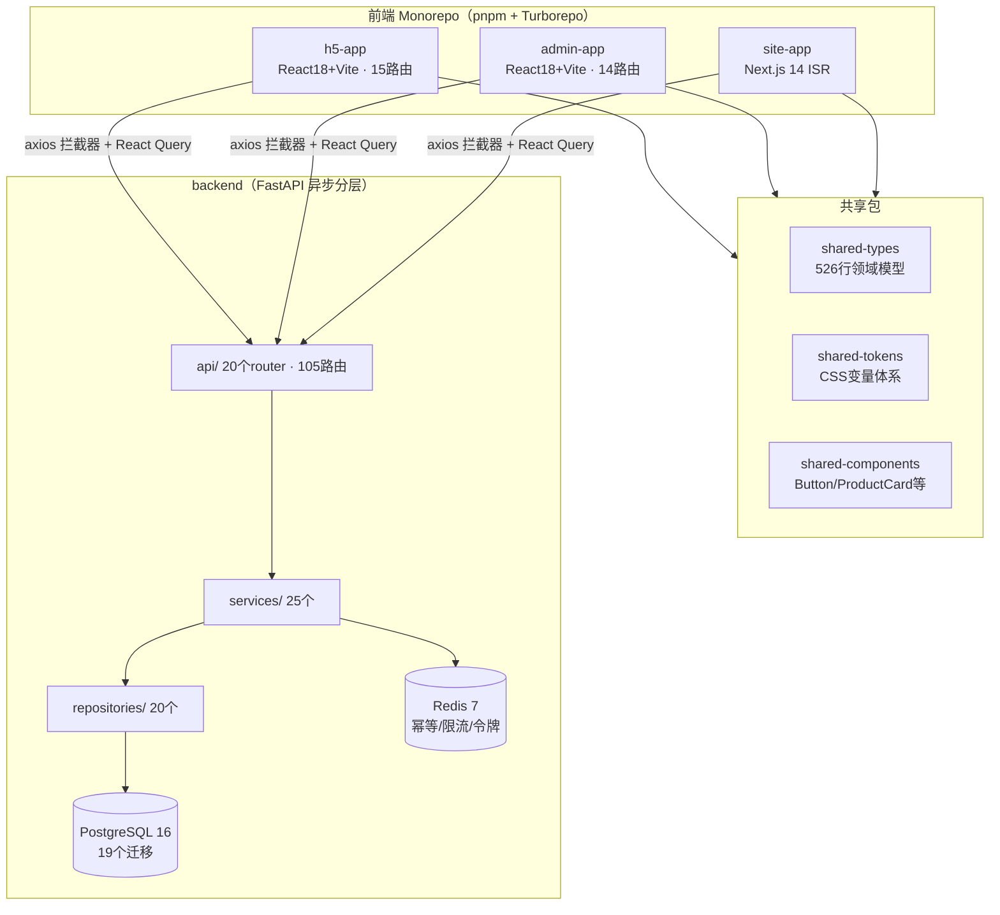

# LiteShop 全栈代码分析报告与修复建议

> 生成日期：2026-09-07；复核更新：2026-09-07
> 分析范围：backend / packages（h5-app、admin-app、site-app、shared-*）/ tests/e2e / 根工程配置
> 分析方式：3 个并行子任务精读约 100 个核心文件 + grep 全库模式验证，所有问题均附 `文件:行号` 证据

---

## 一、总体结论

**这是一个工程纪律性较强、但仍处于持续收口阶段的代码库**：后端并发/幂等/金额处理设计扎实，前端类型纪律和防抖规约执行较好；本轮复核确认上一版报告列出的 3 个 Critical 与 H1-H5 已完成整改并有回归验证。当前主要风险转为低代码数据消费、售后完整闭环、真实数据库并发覆盖和工程架构收敛，不能据此宣称已达到生产就绪。

### 1.1 规模统计

| 指标 | 数值 |
|---|---|
| 后端 | 158 个 py 文件 / ~13,250 行 / 105 路由 / 19 迁移 / 47 个 pytest 用例 |
| h5-app | 65 文件 / 4,294 行 / 15 路由 |
| admin-app | 70 文件 / 4,621 行 / 14 路由 |
| site-app | Next.js 14 App Router，ISR 三层协同 |
| 最大文件 | api/admin.py 661 行、services/admin.py 567 行、page-builder 645 行 |
| 坏味道 | TODO/FIXME/`except:pass`/注释代码块 全部为 **0** |

### 1.2 各端质量评分

| 维度 | 后端 | H5 | Admin | 共享包 | 官网 | E2E |
|---|---|---|---|---|---|---|
| 架构设计 | ★★★★☆ | ★★★★☆ | ★★★☆☆ | ★★★☆☆ | ★★★★☆ | ★★☆☆☆ |
| 并发/数据正确性 | ★★★★★ | ★★★☆☆ | — | — | — | — |
| 安全 | ★★★★☆（历史 C1/H1 已修复；真实供应商仍未接入） | ★★★★☆ | ★★★★☆ | — | ★★★★☆ | — |
| 测试 | ★★★☆☆（47 个单测，DB 并发路径仍薄） | ★★☆☆☆ | ★★☆☆☆ | ★★★☆☆ | ★★★☆☆ | ★★★☆☆ |
| 代码卫生 | ★★★★★ | ★★★★★ | ★★★★☆ | ★★★★☆ | ★★★★☆ | — |

---

## 二、架构分析

### 2.1 架构总览



### 2.2 后端

- **分层**：`api → services → repositories → models` 总体严格（grep 验证 api 层无 repository import，仅 2 处越层，见 M4）
- **订单状态机**：行锁（FOR UPDATE）+ 条件更新（`UPDATE ... WHERE status=:old`）双保险，5 状态 + 流转白名单
- **库存三层模型**：`physical/locked/available`，所有操作为单条原子条件 UPDATE + RETURNING，DB 层 4 条 CheckConstraint，双写 InventoryLedger 流水
- **幂等三层防护**：Redis `SET NX` → DB 唯一索引 `(user_id, request_id, action_type)` → 业务唯一约束；响应仅在事务提交后写缓存，IntegrityError 回查而非重复执行
- **支付回调**：HMAC-SHA256 验签（`hmac.compare_digest` 防时序攻击），签名含渠道+订单+金额+callback_id+流水号五要素，回调幂等靠 `payments.callback_id` 全局唯一约束
- **最大特征与风险**：`use_database` 开关贯穿 19 文件 81 处分支，每接口都有「内存假数据 + DB 真实」双路径——零依赖可启动，但双倍代码路径 + 漂移风险

### 2.3 前端（h5-app / admin-app）

- **入口链清晰**：`main.tsx → App.tsx → router/`，全部 lazy + Suspense；扁平旧文件（routes.tsx/main-page.tsx 等）均为 1~3 行 re-export 兼容层，死代码 <15 行，无架构风险
- **数据流统一**：`service/http.ts` 拦截器（Bearer + X-Request-Id + envelope 校验）→ React Query hooks（`features/*/api`，mutation 全部 `retry: 0`）→ Zustand 仅管 session/cart，职责边界干净
- **认证守卫**：Admin 有路由级统一守卫（AdminLayout）；H5 仍有约 8 处页面级守卫样板，`RequireAuth` 抽象可作为后续收口项
- **useDebounceAction**：单一事实源在 shared-components（123 行，controller 模式，含卸载安全/异常释放），子应用全部 re-export，非真实现象

### 2.4 共享包 / 官网 / E2E

- **shared-types**：526 行领域模型覆盖广、TSDoc 齐全，但金额字段两套命名并存（M6）
- **shared-tokens**：已补包入口和 CSS 子路径；字号重复命名、gallery 变量作用域和 z-index 规范仍需后续收口（M7）
- **shared-components**：全部 "use client"、全走 CSS 变量、CHANGELOG 与版本对齐；组件零渲染测试
- **官网**：ISR 三层协同（页面 revalidate + fetch tags + revalidateTag 入口）+ 蜜罐 + token/白名单防护，失败安全回退设计好；首页 metadata 已补，仍需浏览器级 SEO 回归
- **E2E**：当前 5 个 Playwright 测试，已覆盖交易主链路桩测试；真实外部支付/数据库并发仍不在本地 E2E 范围（H9 由 Critical 风险降为覆盖增强项）

---

## 三、问题清单汇总

### 历史 Critical（3 项，均已修复并回归验证）

| # | 问题 | 位置 |
|---|------|------|
| C1 | 固定短信验证码无环境门控 | 已改为随机一次性验证码、Provider 门控；生产/预发布缺少真实 Provider 时拒绝启动，并已补测试 |
| C2 | 购物车删除失败回滚无效 | 已用 `upsertLocal` 恢复被删除行并补 H5 回归测试 |
| C3 | 无 401 统一处理与会话过期机制 | H5/Admin 已加入 HttpOnly Cookie、401 单飞刷新、重放与失败清会话 |

### High（9 项）

| # | 问题 | 位置 |
|---|------|------|
| H1 | RBAC 硬编码后门 | 已删除后门并补非数字 subject 拒绝测试；首个管理员改由种子/正式权限数据创建 |
| H2 | 可疑依赖 `httpx2` | 已替换为主流 `httpx` 并通过后端测试 |
| H3 | 幂等键随请求随机再生 | 拦截器改为仅在缺失时生成，订单/支付动作复用稳定 request id |
| H4 | 下单后清车失败误导 | 订单创建与清车拆开处理，部分清理失败会明确提示且不诱导重复下单 |
| H5 | Admin 商品 queryKey 冲突 | 已删除无调用方旧 hook/API，并补购物车与构建回归验证 |
| H6 | UI 库与宪法描述不一致 | 当前未迁移 antd；已形成独立 ui-kit 方向，但创建新包、引入 Radix/动画/表单依赖前仍需架构确认 |
| H7 | shared-tokens 无包入口 | 已补 `main/types/exports` 与 CSS 子路径，并完成消费者 typecheck |
| H8 | h5/admin 幽灵依赖 | 已将 Vite、插件和 TypeScript 声明到各子包并通过 workspace 构建 |
| H9 | E2E 覆盖不足与版本漂移 | 已对齐 Playwright 并新增交易主链路，当前全量 5/5；真实数据库/第三方链路仍需独立环境 |

### Medium（10 项）

| # | 问题 | 位置 |
|---|------|------|
| M1 | 聚合大文件：api/admin.py 661行/33路由/10域、services/admin.py 567行上帝类、api/orders.py 524行 | backend/app/api/admin.py 等 |
| M2 | 内存/DB 双实现行为差异大（内存版无价格校验/无库存联动），契约一致性无自动化保障 | backend/app/services/order.py |
| M3 | page-builder 645 行巨型组件（8+ 职责），绕过 React Query 直接调 service | admin-app/src/pages/page-builder/index.tsx:144-319 |
| M4 | API 越层调 repository 2 处 | api/admin.py:371、api/logistics.py:29 |
| M5 | 错误码语义复用：42901 同时表示"幂等并发中"和"限流"；40901 被用于非订单流转错误 | api/orders.py:91、api/auth.py:61 |
| M6 | shared-types 金额字段两套命名并存：`amountCents` vs `totalAmount`（同为分） | shared-types/src/models.ts:125-138 |
| M7 | tokens.css 混乱：字号两套命名重复取值、gallery 变量混入 :root、z-index token 全缺、硬编码紫色 | shared-tokens/src/tokens.css:53-110 |
| M8 | 官网首页无 SEO metadata（home 的 seo 字段定义了但从未消费） | **已修复**：已补首页 `generateMetadata`；仍需浏览器级 SEO 回归 |
| M9 | eslint 无 react-hooks 插件；`--ext` 在 flat config 下有报错风险；site-app lint 漏掉 app/ 目录 | **已部分修复**：规则与命令已收口；hook 规则仍需作为 CI 门禁持续执行 |
| M10 | `passlib[bcrypt]` 声明未使用；deploy.ps1 只起基础设施不部署应用；verify-plan.ps1 只查文件存在 | 仍是发布前工程欠账，不能把基础设施启动脚本当作应用部署 |

### Low（9 项）

死代码兼容层文件 9 个；`/auth/sms/send` deprecated 路由未清理；订单超时单事务批 100 单长事务风险；Redis 降级进程内字典（多 worker 失效）；contact 路由 email 校验仅 `includes('@')`；sitemap `lastModified` 恒为当前时间；smoke 测试断言占位实现而非真实行为；`.env.example` 缺 3 个 site-app 变量；revalidate token 非常量时间比较。

---

## 四、详细修复方案与整改记录

> 本节保留问题的根因与方案，便于审计和回归。C1/C2/C3、H1-H5、H7-H8 已在本轮前完成；阅读时以第三节状态表为准，不要把“方案代码”误认为待实施任务。

### C1. 固定验证码无环境门控（已修复）

**根因**：`send_sms_code` 在 `use_database=true` 时仍把固定值写入 Redis 且从不真正发短信；`__post_init__` 生产校验未覆盖此项。

**已执行方案**（3 步）：

1. `config.py` 新增 `sms_provider` 配置 + 生产门控：

```python
sms_provider: str = os.getenv("SMS_PROVIDER", "dev")  # dev | aliyun | tencent

# __post_init__ 内追加：
if self.environment in {"staging", "production"} and self.sms_provider == "dev":
    raise ValueError("预发布和生产环境必须配置真实短信服务商 SMS_PROVIDER")
```

2. `services/auth.py` 改为随机验证码 + Provider 抽象：

```python
import secrets

class SmsSender(Protocol):
    async def send(self, phone: str, code: str) -> None: ...

class DevConsoleSmsSender:
    """开发环境验证码仅打印日志，禁止返回给前端。"""
    async def send(self, phone: str, code: str) -> None:
        logger.info("sms_code_issued", phone=phone)

# send_sms_code 改为：
code = f"{secrets.randbelow(1_000_000):06d}"
await redis_client.set(f"sms:code:{phone}", code, ex=300)
await self.sms_sender.send(phone, code)
```

删除 `development_code = "123456"` 类属性。若开发联调需要固定码，用独立开关 `SMS_DEV_FIXED_CODE` 且仅 `environment == "development"` 生效。

3. 补测试：staging/production 下 `send_sms_code` 不再产生固定码；门控缺失时拒绝启动。

### C2. 购物车删除失败回滚无效（已修复）

**根因**：`removeLine` 用 filter 删行后，catch 里调 `updateLine`（map 实现）找不到 skuId 静默无操作。

**已执行方案**：store 增加 `upsertLine`，回滚改用它：

```ts
// store/cart.ts
upsertLine: (line) =>
  set((state) => ({
    lines: state.lines.some((item) => item.skuId === line.skuId)
      ? state.lines.map((item) => (item.skuId === line.skuId ? line : item))
      : [...state.lines, line],
  })),
```

```tsx
// cart/index.tsx remove 的 catch 分支：
upsertLine({ skuId: line.skuId, quantity: line.quantity, priceCents: line.priceCents });
setSelectedIds((ids) => (ids.includes(skuId) ? ids : [...ids, skuId]));
```

补单测：mock `removeCartItem` reject，断言行恢复且 skuId 回到 selectedIds。

### C3. 无 401 统一处理与会话过期机制（已修复）

**根因**：拦截器只有成功分支；`expiresIn` 被丢弃；后端有完整的 `/auth/refresh` 轮换接口（HttpOnly Cookie）但前端从未调用。

**已执行方案**（h5 与 admin 同构）：

1. axios 实例开启 `withCredentials: true`（后端 CORS 已 `allow_credentials=True`）
2. 单飞刷新 + 401 重放：

```ts
let refreshPromise: Promise<string | null> | null = null;

function refreshAccessToken(): Promise<string | null> {
  if (!refreshPromise) {
    refreshPromise = httpClient
      .post<ApiEnvelope<{ accessToken: string }>>('/auth/refresh')
      .then((response) => {
        useSessionStore.getState().setAccessToken(response.data.data.accessToken);
        return response.data.data.accessToken;
      })
      .catch(() => {
        useSessionStore.getState().clear();
        return null;
      })
      .finally(() => { refreshPromise = null; });
  }
  return refreshPromise;
}

httpClient.interceptors.response.use(
  (response) => { /* 现有 envelope 校验不动 */ },
  async (error) => {
    const config = error.config;
    if (
      axios.isAxiosError(error) &&
      error.response?.status === 401 &&
      config &&
      !config.headers.get('X-Retried') &&
      !config.url?.includes('/auth/login')
    ) {
      const token = await refreshAccessToken();
      if (token) {
        config.headers.set('Authorization', `Bearer ${token}`);
        config.headers.set('X-Retried', '1');
        return httpClient.request(config);
      }
    }
    return Promise.reject(error);
  },
);
```

3. 刷新失败后由各页面现有守卫自然跳登录。

### H1. RBAC 硬编码后门（已修复）

- **推荐（根治）**：删除 `subject == "admin"` 分支；提供 `backend/scripts/create_admin.py` 种子脚本（插入首个超管 + 全量角色权限）
- **最低限度**：改为 `if settings.environment == "development" and subject == "admin": return`
- 补测试：非数字 subject 必须抛 `AdminPermissionDenied`

### H2. 可疑依赖 httpx2（已修复）

`isr.py` 改 `import httpx`（API 完全兼容）；requirements.txt 替换为 `httpx>=0.27,<1`；重装后跑 pytest 验证。

### H3. 幂等键随请求随机再生（已修复）

幂等键生命周期绑定"逻辑动作"而非"HTTP 请求"：

```ts
// 拦截器改为"没有才设置"，允许调用方覆盖：
if (!config.headers.get('X-Request-Id')) {
  config.headers.set('X-Request-Id', crypto.randomUUID());
}

// 写操作服务函数显式接收 requestId：
export async function createOrder(input: OrderCreateRequest, requestId: string) {
  const response = await httpClient.post('/orders', input, {
    headers: { 'X-Request-Id': requestId },
  });
  return response.data.data;
}

// order-confirm：进入页面生成一次，成功后失效
const requestIdRef = useRef(crypto.randomUUID());
// 提交成功后 requestIdRef.current = crypto.randomUUID();
```

`createPayment` 同理（叠加 paidRef 单会话幂等）。

### H4. 下单后清车失败误导（已修复）

try/catch 只包 `createOrder`；清车改 `allSettled`：

```tsx
const order = await createOrder(payload, requestIdRef.current);
const results = await Promise.allSettled(lines.map((line) => removeCartItem(line.skuId)));
clearCart();
setSubmitted(true);
if (results.some((r) => r.status === 'rejected')) {
  setActionFeedback('订单已提交；部分商品清车失败，购物车将在下次同步时自动修正。');
}
```

### H5. Admin 双商品查询 queryKey 冲突（已修复）

删除 `src/hooks/useProductsQuery.ts` 与 `src/service/products.ts`（删前 grep 确认仅桶文件 re-export）；从 `hooks/index.ts` 移除导出。

### H6. UI 库路线（已形成方向，尚未实施）

- ~~**A**：按宪法引入（h5 用 antd-mobile 5、admin 用 antd 5）~~
- **B（当前方向，2026-09-07）**：不引入 antd 系；规划独立 `packages/ui-kit`（headless 底座 + `--ui-*` CSS 变量主题 + 可选表单薄层），跨项目可复用。该包尚未创建，不能把方案文档当作实现完成。
- ~~**C**：暂缓，1b 期再决策~~

> 方向与边界见《UI组件库设计方案.md》；连带影响：M7 优先级升为高（ui-kit 前置）、AGENTS.md 技术栈条款需修订（宪法变更，执行前单独确认），Radix/Framer Motion/RHF/zod 等新增依赖也必须单独确认。

### H7. shared-tokens 无包入口（已修复）

package.json 补 `exports: { ".": "./src/index.ts", "./tokens.css": "./src/tokens.css" }`；消费方从相对路径改为 `@import '@liteshop/shared-tokens/tokens.css'`（3 处）。

### H8. 幽灵依赖（已修复）

h5/admin 的 devDependencies 显式补齐 `vite`、`@vitejs/plugin-react`、`typescript`（版本对齐根）；`pnpm install` 更新 lockfile；`pnpm -r build` 验证。

### H9. E2E 覆盖（已补主链路，仍有环境缺口）

1. 已将 `@playwright/test` 版本与 workspace 对齐，并由 e2e 包在运行前构建 shared 包。
2. 已补交易链路 spec：加购 → 购物车 → 下单 → 支付创建 → 订单列表，当前全量 5/5 通过。
3. 仍需补真实 PostgreSQL/Redis 并发 fixture、Admin 关键流程和 axe-core 键盘覆盖；这些属于后续验收计划，不应以 mock E2E 代替。

---

## 五、Medium/Low 修复要点

| # | 方案 |
|---|---|
| M1 | 按域拆分 api/admin.py（→ catalog/orders/inventory/members/rbac/audit/dashboard/freight router），services/admin.py 同步拆分；保持路由路径与契约不变（plan-26） |
| M2 | 双实现加契约一致性测试：同一请求分别打两模式 TestClient，断言响应结构相等；长期删除内存模式 |
| M3 | page-builder 拆分：usePageHistory/useAutoSave hooks + ComponentPalette/Canvas/PropsPanel 子组件；数据流改 React Query |
| M4 | 2 处越层改为 service 方法：ReviewService.list_for_audit() / LogisticsService.get_order() |
| M5 | 错误码拆分：限流独立 42902，非订单流转 40901 场景各配专属码。**契约变更**：同步 docs/api-contracts/ + error-codes.md 并人工确认 |
| M6 | 金额字段统一 Cents 后缀。**MAJOR 破坏性**：按 §4.4.2 两步走（先加新字段 + 旧字段 @deprecated，下一版删除） |
| M7 | tokens.css：删重复字号命名；--gallery-* 挪到 [data-gallery] 作用域；补 --z-index-* token；--chart-color-5 改由色阶派生 |
| M8 | **已完成**：官网首页补 `generateMetadata`；后续补浏览器级 SEO 回归 |
| M9 | **部分完成**：lint 命令与范围已收口；hook 规则仍需作为 CI 门禁持续执行 |
| M10 | 删 passlib[bcrypt]；deploy.ps1 改名 start-infra.ps1 或补应用容器；verify-plan.ps1 补真实验证命令 |

**Low 一句话清单**：删 9 个死代码兼容层文件；删 deprecated 路由 `/auth/sms/send`；超时批处理 100→10~20 单分事务；contact 加 email 正则 + message 长度上限；sitemap lastModified 改消费 updatedAt；.env.example 补 3 变量；revalidate token 改常量时间比较；shared-types 补 ./enums 子路径导出。

---

## 六、亮点（值得保持）

1. **后端并发正确性**：库存原子条件 UPDATE + RETURNING、订单行锁+乐观锁、超时任务 `skip_locked`、refresh token Redis Lua 原子轮换
2. **幂等三层防护时序正确**：响应仅在事务提交后写缓存，IntegrityError 回查而非重复执行
3. **金额纪律全链路满分**：后端 Decimal + ROUND_UP 运费计算，前端 0 处 `toFixed(2)`/`¥` 拼接
4. **前端类型纪律**：两应用 0 `any`/0 `@ts-ignore`/0 硬编码色值，strict 模式
5. **防抖全覆盖**：H5 18 处、Admin 17 处 useDebounceAction，写按钮 100% loading disabled
6. **官网 ISR 三层协同** + 蜜罐 + token/白名单防护 + 失败安全回退
7. **支付安全测试意识**：签名五要素防篡改、回调重放、归属校验顺序均有专门用例

---

## 七、执行路线图

| 批次 | 内容 | 验证命令 |
|---|---|---|
| **已完成批次** | C1 + H1 + H2；C2 + C3 + H3 + H4；H5 + H7 + H8；H9 已补主链路 | 后端/前端/Workspace/E2E 验证见交接文档 |
| **当前收口** | M1/M2/M3/M4/M7/M9/M10 与低代码、售后、Admin/H5 体验缺口 | 按 `plans/INDEX.md` plan-32~37 拆分，不以文档状态替代代码验收 |
| **需要决策** | H6 ui-kit、M5 错误码、M6 金额字段、真实供应商和重型动画/3D 依赖 | 按 AGENTS.md §8.6 请示，确认前不改契约/不装新依赖 |

> 每批完成后按 AGENTS.md §5.1 跑各端验证命令；批次 4 涉及架构/契约变更，需用 AskUserQuestion 逐项确认。

---

## 八、框架迁移残留文件清单（2026-09-07 引用链核实）

> 以下清单基于 grep 引用链逐一核实（import 追踪 + 桶文件检查）。删除验证命令：`cd packages/<app> && tsc --noEmit && pnpm build`。建议并入执行路线图批次 3（工程卫生）处理。

### A 类：完全死代码（零引用，可直接删除）— 17 个文件

**h5-app（7 个）**

| 文件 | 内容 | 判定依据 |
|---|---|---|
| `src/routes.tsx` | re-export `./router` | App.tsx 直接 import `./router`，无引用 |
| `src/main-page.tsx` | re-export `pages/home` | 无引用 |
| `src/trade-pages.tsx` | re-export | 无引用 |
| `src/useDebounceAction.ts` | re-export hooks 版 | 页面全部从 `hooks/` 导入，无引用 |
| `src/service/index.ts` | service 桶 | 无页面从 `../service` 导入 |
| `src/utils/index.ts` | utils 桶 | 无引用 |
| `src/utils/format-price.ts` | re-export shared-types | 仅被死桶 utils/index.ts 引用 |

**admin-app（9 个）**

| 文件 | 内容 | 判定依据 |
|---|---|---|
| `src/routes.tsx` | re-export | 无引用 |
| `src/main-page.tsx` | re-export | 无引用 |
| `src/admin-pages.tsx` | re-export | 无引用 |
| `src/product-editor.tsx` | re-export | 无引用 |
| `src/useDebounceAction.ts` | re-export | 无引用 |
| `src/hooks/useProductsQuery.ts` | 独立实现（走 `/products`） | 无调用方；与 features 版共用 queryKey，有缓存污染隐患（即 H5 问题） |
| `src/service/products.ts` | 商品 API | 仅被死 hook 引用 |
| `src/service/index.ts` | service 桶 | 无引用 |
| `src/utils/index.ts` | utils 桶 | 无引用（utils/format-price.ts 被 4 页面直接引用，是活的） |

**site-app（1 个）**

| 文件 | 内容 | 判定依据 |
|---|---|---|
| `src/page.tsx` | 旧静态占位首页 | Next.js 实际入口是 `app/page.tsx`，无引用 |

### B 类：仅测试引用（2 个）— 测试改造后删除

| 文件 | 引用方 | 建议 |
|---|---|---|
| h5 `src/app-data.ts` | main.test.ts:2 | 断言"demo 商品=4 个"价值低，删用例或改断言真实逻辑后删文件 |
| admin `src/app-data.ts` | main.test.ts:2 | 同上（断言指标标签数=4） |

### C 类：活的兼容出口（5 个）— 先迁引用再删

| 文件 | 活引用 | 收敛方式 |
|---|---|---|
| admin `hooks/useAdminQueries.ts`（18 个 hook 聚合出口） | 仅 audit 页经桶用 `useAuditLogsQuery`（hooks/index.ts:21） | audit 页改从 `features/audit` 导入 → 删文件 + 删桶导出 |
| admin `service/admin.ts` | features/settings、features/contact 两个 api 文件 | 改从 `service/admin/<domain>` 导入 → 删文件 |
| h5 `hooks/useProductsQuery.ts` | favorites/categories/product-detail/home 4 个页面 | 页面改从 `features/catalog` 导入 → 删文件 |
| admin `utils/format-price.ts` | 4 个页面 | 改从 `@liteshop/shared-types` 导入 → 删文件 |
| h5/admin `hooks/useDebounceAction.ts` | 大量页面（admin 7 页面经桶） | **可保留**（无害薄转发）；或统一改为直接从 `@liteshop/shared-components` 导入 |

> 附带发现：admin `hooks/index.ts` 是唯一活桶（7 页面引用），但它把 useAdminQueries 的 18 个兼容 hook 全量再导出，成了兼容出口的放大器——收敛时应同步瘦身。

---

## 九、前端主流写法建议

### 9.1 已符合主流（保持不动）

路由集中配置 + lazy/Suspense、React Query 与 Zustand 职责分离（服务端/客户端状态）、mutation `retry: 0`、TS strict + 零 `any`、CSS 变量零硬编码、防抖单一事实源（shared-components）。

### 9.2 P1 结构治理

1. **死代码一次性清理**：A 类 17 个 + B 类 2 个，一个 PR 删完，删除后跑 tsc + build 验证
2. **导入规范统一**：确立规则——领域数据 hook 一律从 `features/<domain>/api` 导入，桶只留跨领域基础 hook；用 ESLint `no-restricted-imports` 强制，防止桶再膨胀
3. **兼容出口定删除时间表**：C 类每个文件标 `@deprecated` + 明确清理 PR，避免"兼容层永远兼容下去"
4. **RequireAuth 声明式守卫**：h5 8 处页面级守卫样板（orders/order-detail/payment/addresses/favorites/notifications/me/order-confirm）→ 一个 `<RequireAuth><Outlet/></RequireAuth>` 嵌套路由组件；admin 的 AdminLayout 已是正确示范

### 9.3 P2 写法升级

5. **表单迁移 react-hook-form + zod**：宪法技术栈要求；现状 admin 编辑器/订单操作/h5 地址表单全是手写 useState；zod schema 可与后端 Pydantic 契约对齐
6. **操作反馈 toast 化**：现状内联 actionFeedback（a11y 好），宪法要求"组件层 toast"；应由未来 ui-kit 的 Toast 承接，不为此恢复 antd 依赖
7. **demo 数据外置**：query hooks 内嵌 18~43 行 demo 快照（4 处）→ 独立 demo-data 文件或 MSW
8. **page-builder 拆分**：645 行 → usePageHistory/useAutoSave + 子组件；数据流改 React Query（对应 M3）

### 9.4 P3 工程保障

9. **eslint-plugin-react-hooks**：`rules-of-hooks: error` + `exhaustive-deps: warn`（对应 M9）
10. **核心链路测试**：交易流已补 Playwright 主链路；后续继续补 Admin、真实数据库并发和 axe-core 键盘覆盖
11. **UI 库决策**（对应 H6，影响第 6 条）
12. **i18n 决策**：宪法要求全 i18n key，现状全硬编码中文——要么排期做要么修订宪法

---

## 十、async/await 与 .then 写法约定（复核后修订）

### 10.1 结论

不把 `.then` 或 `async/await` 设为全局硬规则。当前项目以 `async/await` 为主，复杂事务、补偿、轮询和多分支编排优先保持该风格；简单的一次性转换可以使用 `.then`。同一函数内不要混用两种风格，错误处理必须有明确归宿。

**基础设施兼容性已核实**：`useDebounceAction` 的 `run` 为 async 且 `await action(...)` 包在 try/finally 内（`shared-components/src/useDebounceAction.ts`），React Query 的 queryFn/mutationFn 也会正确传播 rejection。因此不需要为了满足形式统一而机械改写约 35 个 service 函数。

### 10.2 推荐使用 `.then` 的场景（按需）

| # | 场景 | 目标写法 | 涉及文件 |
|---|---|---|---|
| 1 | service 层一次性请求 + 解包 | 单表达式 `.then((r) => r.data.data)` | 新增或自然触碰的简单 service |
| 2 | 单步 + 乐观回滚 | `api().catch(() => { 回滚 })` | cart、收藏等简单动作 |
| 3 | 简单线性多步 | 平链 + 尾部 `.catch` | 无分支、无补偿的编排 |
| 4 | query hooks 的 DEV 演示回退 | queryFn 单表达式 + `.catch` 分支 | 仅在不损失可读性时使用 |

第 3 类示例（order-confirm 提交，全平链）：

```tsx
const [submit, loading] = useDebounceAction(() => {
  if (!address || !lines.length) return;
  if (!authenticated) return void navigate('/login', { state: { from: '/order-confirm' } });
  setSubmitError('');
  return createOrder(buildPayload(), requestIdRef.current)
    .then(() => Promise.allSettled(lines.map((line) => removeCartItem(line.skuId))))
    .then((results) => {
      clearCart();
      setSubmitted(true);
      if (results.some((r) => r.status === 'rejected')) {
        setActionFeedback('订单已提交；部分商品清车失败，购物车将在下次同步时自动修正。');
      }
    })
    .catch(() => setSubmitError('订单提交失败，请检查库存和金额后重试。'));
}, 1000);
```

第 4 类示例（queryFn 演示回退）：

```ts
queryFn: () =>
  listProducts(query).catch((error) => {
    if (isRecoverableApiError(error)) return demoProducts;
    throw error;
  }),
```

### 10.3 优先保留 async/await + try/catch 的场景

1. **while 轮询**（支付状态轮询等）
2. **串行 for...of 循环**（逐行顺序同步）
3. **三路以上分支流**（每分支接不同异步链）
4. **多步补偿事务**（第 N 步失败需按逆序撤销前序步骤）
5. **需要稳定 request id、事务边界或明确错误分层的写操作**

### 10.4 护栏规则

1. `.then` 回调必须 `return` 后续 promise，禁止遗失 rejection
2. 错误处理要覆盖同步异常与异步 rejection，清理动作用 `.finally`
3. 同一函数内不混用两种风格
4. 事务、幂等、补偿逻辑以可读性和可验证性优先，不做机械风格迁移

### 10.5 迁移策略

- **service 层**：新代码遵循上述按场景选择，不要求一次性重写既有函数
- **编排层**：随业务改动逐步统一，避免产生无业务含义的大范围 diff

---

*本报告基于 2026-09-07 代码快照生成，行号以当日文件为准。*
